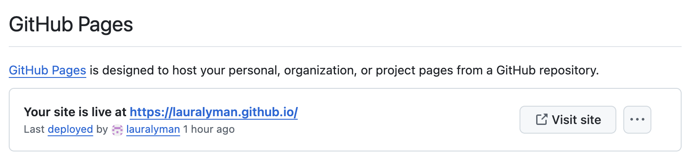

## Set Up
1. In a separate tab, open up Github and log into your account associated with your MHC email address.


2. Navigate to your `test_website` directory (folder) in [rstudio.mtholyoke.edu](https://rstudio.mtholyoke.edu/). At this point, your `test_website` directory should just have:

  * `.gitignore`
  * `README.md`
  * `test_website.Rproj`

3. Make sure you can see the `Git` tab (usually on the top right by `History` and `Environment`. If you can't, double-click on your `test_website.Rproj` file in the `Files` explorer (usually the panel on the bottom right).


## Create the Quarto Website

1. Click `File` -> `New Project` ->  `New Directory` -> `Quarto Website` and make sure this is saved under your `test_website` directory.

2. Choose the name of your new Quarto website directory.

    (a) If your website will be hosted at https://username.github.io (this is the default),
  
    * save the `Directory name` as `username.github.io`; for example, since my website will be at [https://lauralyman.github.io]([https://lauralyman.github.io), I will save my directory name as `lauralyman.github.io`
    
   (b) If your website will be hosted at `https://username.github.io/some_name` (this is probably *not* the case),
    *  save the `Directory name` as `some_name` 


3. Select `Knitr` as the associated engine. Make sure nothing is selected except (optionally) `Use visual markdown editor` 

We now have all the ingredients for a default Quarto website.

When you initialize a Quarto website, RStudio will automatically produce:

* `_quarto.yml`
* `about.qmd`
* `index.qmd`
* `style.css`
* an `Rproj` file (in my case, `lauralyman.github.io.Rproj`)

## Exploring Your Website

#### (1) `_quarto.yml`

The `_quarto.yml` file includes:
    * the title of your website;
    * pages on the website:
        * the main landing page is `index.qmd`;
        * `about.qmd` is an optional additional page (that is, where you might write about yourself on a website);
    * a format section under `format` (includes, for example, the color scheme of the website)


#### (2) `index.qmd`

The `index.qmd` file controls default homepage for your website. To see ways to customize this website, check out this guide: [https://quarto.org/docs/reference/projects/websites.html](https://quarto.org/docs/reference/projects/websites.html)


#### (3) `styles.css`

The `styles.css` file is where you can place custom styles in your website (optional)


**To render initial version of your website, navigate to `index.qmd` and hit `Render`.**

::: {.callout-tip collapse="false" icon="true"}

# Exercise

1. The `title` field in `index.qmd` is the header text at the top of your landing page (home page). Change it to something else. For example, I will change it to say "Welcome to my website!". 
<br></br>
Click `Render` to see if your change worked! 

2. Under `_quarto.yml`,  change the `title` field to different text. For example, I will change mine to say 
"Laura Lyman's Website".
<br></br>
Go back to `index.qmd` to hit `Render` to see your changes. 

:::


## Changing Output Directory of Quarto Website

**This step is _critical_ if you want to host your website on Github using Github pages (which you do!)**


The output directory is the folder is where Quarto saves the files to render your website. To use Github pages, we need this output directory to be named `docs`.

1. Go to `_quarto.yml`

2. Add the line `output-dir: docs` under `type: website`. For example, my code looks like this:

```{r eval = F}
project:
  type: website
  output-dir: docs
```


3. Hit save

3. Navigate back to `index.qmd`. You should be able to see the `docs` folder appear.


4. The default folder for website files is `_site`, but now after saving/rendering, we (correctly) have the `docs` folder instead. Go ahead and **delete** the `_site` folder.

## Moving Files to Correct Locations

We actually need all of the generated website code in `username.github.io` to be in your outer directory (the one that is directly linked to Github). I know this step will feel awkward, and I'm sure there's likely a better way to do this, but for now, let's do the following. 

0. *(Time permitting. Laura needs to check this, and we may ignore this step).* Look at the `.gitignore` file in your `username.github.io` directory. Copy its contents. Paste those contents into the `.gitignore` in the directory above it (i.e., the `.gitignore` in the `test_website` directory.)

1. Navigate to your `username.github.io` directory and check *every file inside of it* except for `.gitignore`.

2. Click on the gear icon and then select `Move`. Move all of the files up one directory (to `test_website`).

3. Now navigate to `test_website`. You can actually **delete** the `testwebsite.Rproj` file (but be sure to keep the `Rproj` file with your Github username!) You can also **delete** your directory `username.github.io` now. 


## Commit Changes to Github

Let's try committing what we have to Github. 

1. Click on `Commit` under the `Git` pane (usually on the top right of RStudio).

2. Select all files *except* the `.gitignore` 

3. Add a commit message.

4. Click `Commit`.

5. Click `Push`. 

6. Navigate to your Github account. If successful, you should see your new files added there.


## Configure Website on Github

1. On your Github account, click `Settings` (gear icon on the top of the website).

2. On the left navigation panel, find and click on `Pages`.

3. Under `Branch`, select `main`. **Change the `root` folder to `docs`.**

4. Click `Save`. 


5. Refresh the page. You should eventually see something like this:



**It may take up to 10 minutes to see the above, since it takes time for your website to first deploy.** 

6. Once Github indicates that your website is deployed, click "Visit site" to go look at it. Your website is now on the internet! 


## Adding a Page to Your Website (Time Permitting)

1. Upload a `qmd` file of your choice to your `test_website` directory. For example, I will upload a copy of Lab 7 (where my file is named `Intro-CV.qmd`).

2. Render your `qmd` file to HTML. You should see the `html` file appear in your directory.

3. Render your `qmd` file to PDF. You should see the PDF appear in your directory.

4. Navigate to `_quarto.yml`. Under the `navbar` section, add the `qmd` file underneath `about.qmd` as `- filename.qmd`. For example, the name of my file is `Intro-CV.qmd`, so my code looks like the following.

```{r eval = F}
website:
  title: "Laura Lyman's Website"
  navbar:
    left:
      - href: index.qmd
        text: Home
      - about.qmd
      - Intro-CV.qmd
```

5. Click on `index.qmd` and click `Render`. You should now see your added `qmd` file in the navigation bar at the top of the site, and when you click on it, you should see your file rendered as HTML. 

**Note.** Every time you want to update a page (i.e., update a `qmd` file), you should render that file before rendering `index.qmd`. 
